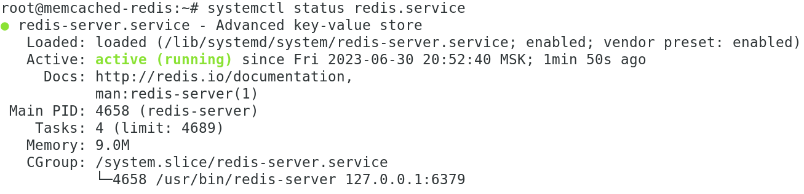

# 11-02_memcached_redis
HW_11-2_Кеширование Redis/memcached

# Домашнее задание к занятию 2 «Кеширование Redis/memcached»

### Задание 1. Кеширование
Приведите примеры проблем, которые может решить кеширование:

- Улучшение производительности базы данных за счет упрощения доступа к данным. Кэш предоставляет своего рода
  "быстрые ссылки" на данные, к которым происходят частые обращения. Более быстрые запросы снижают рабочую
  нагрузку на базу данных, предотвращая дополнительные затраты времени на повторяющиеся задачи.

- Повышение доступности базы данных. В зависимости того, где хранятся кэшированные данные, приложение сможет
  получить данные из кэша при недоступности основного сервера по какой-либо причине. В данном случае кэш
  является дополнительным элементом отказоустойчивости на случай возникновения неполадок на стороне бэкенда.

- Использование кэша положительно сказывается на масштабируемости баз данных, отчасти помогая респределить
  запросы по бэкенд-узлам. Распределение помогает снизить нагрузку на основную базу и может помочь в снижении
  затрат и обеспечить гибкость при работе с данными.

- Позволяет сглаживанить моменты резкого увеличения трафика.

### Задание 2. Memcached.

Установим **Memcached** на ВМ на **Debian 10**:
```
sudo apt update && sudo apt install memcached
```
Проверим статут работы сервиса **memcached.service**:
```
systemctl status memcached.service
```
<kbd></kbd>

### Задание 3. Удаление по TTL в Memcached.

```
telnet localhost 11211
add key1 0 5 4
key1
add key2 0 5 4
key2
add key3 0 5 4
key3
```
<kbd></kbd>

Через 5с делаем запрос на просмотр ключей и их значений:

<kbd></kbd>

Ключей **key1**, **key2** и **key3** больше не существует.

### Задание 3. Запись данных в Redis.

Запишите в **Redis** несколько ключей с любыми именами и значениями:
```
sudo apt update && sudo apt install redis
systemctl status redis.service
```
<kbd></kbd>

```
redis-cli
```
Создадим и просмотрим созданные ключи в базе данных:

```
127.0.0.1:6379> set key1 key1 EX 120
127.0.0.1:6379> get key1
127.0.0.1:6379> set key2 hw_11-02_task4 EX 240
127.0.0.1:6379> get key2
127.0.0.1:6379> set key3 30/06/2023 EX 180
127.0.0.1:6379> get key3
```

<kbd></kbd>
